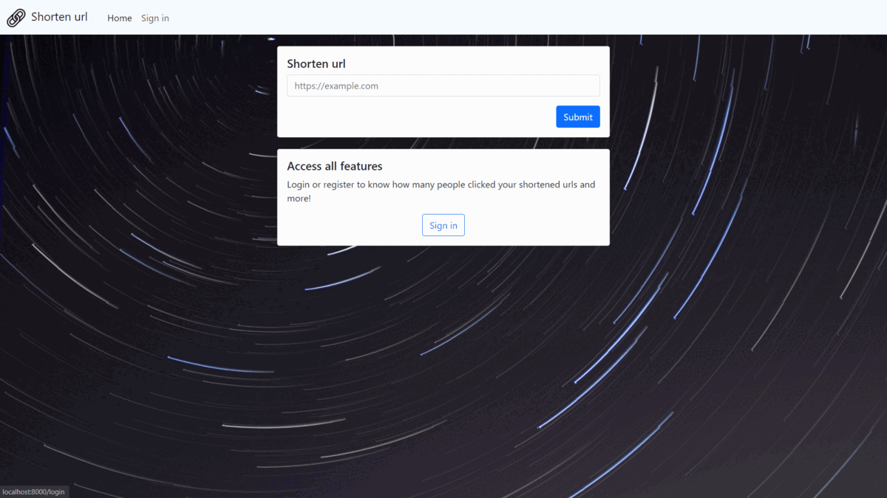

# CS50W Final Project

## Distinctiveness and Complexity

This is my cs50w final project. I developed a URL shortening webapp using Python, JavaScript, HTML, CSS and SQL with the Django framework.
Short url (the name of my webapp) enables users to shorten URLs and receive a shortened URL of their original URL.

To implement the Short url I had in mind that the users may want to use the app without registration but still keep a history of the urls they shortened, so I developed an algorithm that creates a cookie on the client side that is also stored on the backend/Database if the user is not logged in. On the other hand, if the user wants, he can register and will have access to extra features like knowing how many people used the urls they shortened.

I wanted my website to be as dynamic as possible, so I used JavaScript to copy to the clipboard the shortened url automatically and to update the urls list when a new url is shortened. When the user is logged in, he can check the number of views of his urls, this information is updated every 3 seconds, giving the user updates without having to refresh the page.

My webapp is as easy to use as possible with a minimalistic but great design and is mobile-responsive.

The main complexity of my capstone project was to create an algorithm that shortened the url. I used `random` with the ascii lowercase letters to create a unique string that allows the program to identify the original url.

## How to run?

`python -m venv venv`

`venv\Scripts\activate`

`pip install -r requirements.txt`

`python manage.py runserver`

## Short url
